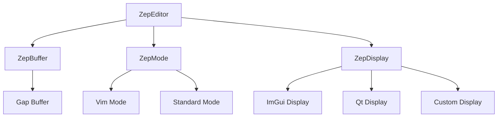

Zep follows a clean, layered architecture that separates concerns between text storage, editing logic, and display rendering. This design makes it easy to embed Zep in different rendering environments while maintaining consistent editing behavior.

## Layered Design

Zep's architecture consists of three primary layers:



### Core Components

The architecture is documented in `include/zep/editor.h:24-41`:

```cpp
// Basic Architecture
//
// Editor
//      Buffers
//      Modes -> (Active BufferRegion)
// Display
//      BufferRegions (->Buffers)
//
// A buffer is just an array of chars in a gap buffer, with simple operations
// A display is something that can display a collection of regions
// A buffer region is a single view onto a buffer inside the main display
```

## Text Layer (ZepBuffer)

The text layer is responsible for storing and manipulating text efficiently:

<CardGroup cols={2}>
  <Card title="Gap Buffer" icon="database">
    Efficient data structure for text editing with O(1) insertions at the cursor
  </Card>
  <Card title="UTF-8 Support" icon="language">
    Full Unicode support through glyph iterators
  </Card>
  <Card title="Line Tracking" icon="list">
    Fast line-based operations and navigation
  </Card>
  <Card title="Undo/Redo" icon="rotate-left">
    Command pattern for reversible operations
  </Card>
</CardGroup>

### Buffer Operations

From `include/zep/buffer.h:154-156`:

```cpp
bool Delete(const GlyphIterator& startOffset, const GlyphIterator& endOffset, 
            ChangeRecord& changeRecord);
bool Insert(const GlyphIterator& startOffset, const std::string& str, 
            ChangeRecord& changeRecord);
bool Replace(const GlyphIterator& startOffset, const GlyphIterator& endOffset, 
             std::string str, ReplaceRangeMode mode, ChangeRecord& changeRecord);
```

## Mode Layer (ZepMode)

The mode layer handles user input and translates it into buffer operations:

<Note>
Modes process keyboard input, handle key mappings, and generate commands that modify buffers. Each mode defines its own editing behavior.
</Note>

From `include/zep/mode.h:66-73`:

```cpp
enum class EditorMode
{
    None,
    Normal,   // Vim normal mode
    Insert,   // Text insertion
    Visual,   // Visual selection
    Ex        // Command line
};
```

### Available Modes

**ZepMode_Vim** (`include/zep/mode_vim.h`): Full Vim emulation with modal editing, operators, motions, and text objects.

**ZepMode_Standard** (`include/zep/mode_standard.h`): Standard editor behavior similar to most modern text editors.

## Display Layer (ZepDisplay)

The display layer is an abstraction that allows Zep to render using any graphics API:

From `include/zep/display.h:71-83`:

```cpp
class ZepDisplay
{
public:
    // Renderer specific overrides
    virtual void DrawLine(const NVec2f& start, const NVec2f& end, 
                         const NVec4f& color = NVec4f(1.0f), 
                         float width = 1.0f) const = 0;
    virtual void DrawChars(ZepFont& font, const NVec2f& pos, 
                          const NVec4f& col, const uint8_t* text_begin, 
                          const uint8_t* text_end = nullptr) const = 0;
    virtual void DrawRectFilled(const NRectf& rc, 
                               const NVec4f& col = NVec4f(1.0f)) const = 0;
    virtual void SetClipRect(const NRectf& rc) = 0;
};
```

<Info>
The display abstraction is minimal by design - only four core drawing primitives are required to implement a complete renderer.
</Info>

## Component Communication

Components communicate through a message broadcasting system:

From `include/zep/editor.h:101-117`:

```cpp
enum class Msg
{
    ModifyCommand,
    HandleCommand,
    RequestQuit,
    GetClipBoard,
    SetClipBoard,
    MouseMove,
    MouseDown,
    MouseUp,
    Buffer,          // Buffer change notifications
    ComponentChanged,
    Tick,
    ConfigChanged
};
```

### Message Flow

1. **User Input** → Mode processes keys
2. **Mode** → Generates commands
3. **Commands** → Modify buffers
4. **Buffers** → Broadcast change messages
5. **Components** → React to changes (syntax, display, etc.)

## The ZepEditor Hub

The `ZepEditor` class ties everything together:

```cpp
ZepEditor(ZepDisplay* pDisplay, const fs::path& root, 
          uint32_t flags = 0, IZepFileSystem* pFileSystem = nullptr);
```

Key responsibilities:

- Manages buffer collection
- Coordinates modes and windows
- Handles configuration and themes
- Broadcasts messages between components
- Provides syntax highlighting registry

## Windows and Tabs

Zep supports multiple windows displaying the same or different buffers:

<Accordion title="Window Hierarchy">
  ```
  ZepEditor
  └── ZepTabWindow (container)
      ├── ZepWindow (displays buffer)
      ├── ZepWindow
      └── ZepWindow
  ```
  
  Multiple windows can display the same buffer with independent cursors and viewports.
</Accordion>

From `include/zep/editor.h:27-30`:

```cpp
// The editor has a list of ZepBuffers.
// The display has multiple BufferRegions, each a window onto a buffer.
// Multiple regions can refer to the same buffer (N Regions : N Buffers)
// The Modes receive key presses and act on a buffer region
```

## Design Principles

<CardGroup cols={2}>
  <Card title="Separation of Concerns" icon="layer-group">
    Text storage, editing logic, and rendering are independent
  </Card>
  <Card title="Pluggable Components" icon="plug">
    Modes, syntax highlighters, and displays are interchangeable
  </Card>
  <Card title="Message-Based" icon="envelope">
    Loose coupling through message broadcasting
  </Card>
  <Card title="Platform Agnostic" icon="desktop">
    No dependencies on specific UI frameworks
  </Card>
</CardGroup>

## Next Steps

<CardGroup cols={2}>
  <Card title="Buffers" href="/concepts/buffers">
    Deep dive into text storage and gap buffers
  </Card>
  <Card title="Modes" href="/concepts/modes">
    Understanding input handling and editing modes
  </Card>
  <Card title="Display Layer" href="/concepts/display-layer">
    Implementing custom rendering backends
  </Card>
  <Card title="Syntax Highlighting" href="/concepts/syntax-highlighting">
    Adding language support and custom highlighters
  </Card>
</CardGroup>
