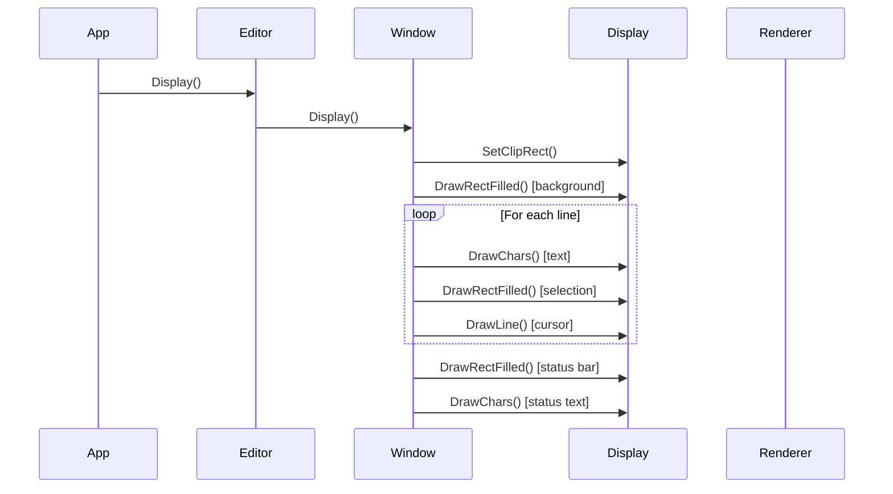

Zep's display layer is a minimal abstraction that allows you to render the editor using any graphics API. By implementing just four drawing methods, you can integrate Zep with ImGui, Qt, SDL, or any other rendering system.

## ZepDisplay Abstract Class

From `include/zep/display.h:71-83`:

```cpp
class ZepDisplay
{
public:
    virtual ~ZepDisplay(){};
    ZepDisplay();
    
    // Renderer specific overrides
    // Implement these to draw the buffer using whichever system you prefer
    virtual void DrawLine(const NVec2f& start, const NVec2f& end, 
                         const NVec4f& color = NVec4f(1.0f), 
                         float width = 1.0f) const = 0;
    virtual void DrawChars(ZepFont& font, const NVec2f& pos, 
                          const NVec4f& col, 
                          const uint8_t* text_begin, 
                          const uint8_t* text_end = nullptr) const = 0;
    virtual void DrawRectFilled(const NRectf& rc, 
                               const NVec4f& col = NVec4f(1.0f)) const = 0;
    virtual void SetClipRect(const NRectf& rc) = 0;
```

<CardGroup cols={2}>
  <Card title="DrawLine" icon="minus">
    Draw a line between two points with color and width
  </Card>
  <Card title="DrawChars" icon="font">
    Render text at a position using the specified font
  </Card>
  <Card title="DrawRectFilled" icon="square">
    Draw a filled rectangle
  </Card>
  <Card title="SetClipRect" icon="crop">
    Set the clipping region for rendering
  </Card>
</CardGroup>

<Info>
That's it! These four methods are all you need to implement to render the entire editor with full functionality.
</Info>

## ZepFont Abstract Class

Along with the display, you need to implement a font class:

From `include/zep/display.h:36-58`:

```cpp
class ZepFont
{
public:
    ZepFont(ZepDisplay& display)
        : m_display(display)
    {
    }
    
    // Implemented in API specific ways
    virtual void SetPixelHeight(int height) = 0;
    virtual NVec2f GetTextSize(const uint8_t* pBegin, 
                              const uint8_t* pEnd = nullptr) const = 0;
    
    virtual int GetPixelHeight() const
    {
        return m_pixelHeight;
    }
    
    virtual const NVec2f& GetDefaultCharSize();
    virtual const NVec2f& GetDotSize();
    virtual void BuildCharCache();
    virtual void InvalidateCharCache();
    virtual NVec2f GetCharSize(const uint8_t* pChar);
```

### Font Requirements

- **SetPixelHeight**: Configure the font size
- **GetTextSize**: Measure text dimensions for layout
- **Character caching**: Optional optimization for common chars

<Note>
Zep uses monospace fonts. The `GetDefaultCharSize()` method returns the width and height of a typical character, which is used for grid layout.
</Note>

## Null Renderer Example

Zep includes a null renderer for testing:

From `include/zep/display.h:127-174`:

```cpp
class ZepDisplayNull : public ZepDisplay
{
public:
    ZepDisplayNull()
        : ZepDisplay()
    {
    }
    
    virtual void DrawLine(const NVec2f& start, const NVec2f& end, 
                         const NVec4f& color = NVec4f(1.0f), 
                         float width = 1.0f) const override
    {
        // No-op: discard
    };
    
    virtual void DrawChars(ZepFont&, const NVec2f& pos, const NVec4f& col, 
                          const uint8_t* text_begin, 
                          const uint8_t* text_end = nullptr) const override
    {
        // No-op: discard
    }
    
    virtual void DrawRectFilled(const NRectf& a, 
                               const NVec4f& col = NVec4f(1.0f)) const override
    {
        // No-op: discard
    };
    
    virtual void SetClipRect(const NRectf& rc) override
    {
        // No-op: discard
    }
    
    virtual ZepFont& GetFont(ZepTextType type) override
    {
        if (m_fonts[(int)type] == nullptr)
        {
            if (m_spDefaultFont == nullptr)
            {
                m_spDefaultFont = std::make_shared<ZepFontNull>(*this);
            }
            return *m_spDefaultFont;
        }
        return *m_fonts[(int)type];
    }
};
```

<Accordion title="ZepFontNull Implementation">
From `include/zep/display.h:108-125`:

```cpp
class ZepFontNull : public ZepFont
{
public:
    ZepFontNull(ZepDisplay& display)
        : ZepFont(display)
    {
    }
    
    virtual void SetPixelHeight(int val) override
    {
        // No-op
    }
    
    virtual NVec2f GetTextSize(const uint8_t* pBegin, 
                              const uint8_t* pEnd = nullptr) const override
    {
        return NVec2f(float(pEnd - pBegin), 10.0f);
    }
};
```

The null font assumes 1 pixel per character width, 10 pixels height.
</Accordion>

## Font Types

Zep supports multiple font types for different UI elements:

From `include/zep/display.h:24-32`:

```cpp
enum class ZepTextType
{
    UI,         // UI elements, tabs, status bar
    Text,       // Main editor text
    Heading1,   // Markdown heading level 1
    Heading2,   // Markdown heading level 2
    Heading3,   // Markdown heading level 3
    Count
};
```

From `include/zep/display.h:89-90`:

```cpp
virtual void SetFont(ZepTextType type, std::shared_ptr<ZepFont> spFont);
virtual ZepFont& GetFont(ZepTextType type) = 0;
```

<Info>
You can provide different fonts for headings and UI elements, or use the same font for everything.
</Info>

## Rendering Flow

When Zep renders, the following sequence occurs:



### What Gets Drawn

1. **Background rectangles** - Editor background, line highlights
2. **Text characters** - Buffer content with syntax colors
3. **Selection highlights** - Visual mode selections
4. **Cursors** - Block or line cursor
5. **Line numbers** - Left gutter
6. **Status bar** - File info, mode, position
7. **Tabs** - Multiple file tabs
8. **Indicators** - Error markers, search highlights

## Coordinate System

Zep uses a standard 2D coordinate system:

- **Origin**: Top-left corner
- **Units**: Pixels
- **Types**: 
  - `NVec2f` - 2D float vector (x, y)
  - `NVec4f` - 4D float vector for colors (r, g, b, a)
  - `NRectf` - Rectangle (topLeft, bottomRight)

```cpp
struct NVec2f {
    float x, y;
};

struct NVec4f {
    float x, y, z, w;  // or r, g, b, a
};

struct NRectf {
    NVec2f topLeftPx;
    NVec2f bottomRightPx;
};
```

## DPI Scaling

Zep supports high-DPI displays through pixel scale:

From `include/zep/display.h:91-92`:

```cpp
const NVec2f& GetPixelScale() const;
void SetPixelScale(const NVec2f& scale);
```

From `include/zep/editor.h:224-227`:

```cpp
#define DPI_VEC2(value) (value * GetEditor().GetDisplay().GetPixelScale())
#define DPI_Y(value) (GetEditor().GetDisplay().GetPixelScale().y * value)
#define DPI_X(value) (GetEditor().GetDisplay().GetPixelScale().x * value)
#define DPI_RECT(value) (value * GetEditor().GetDisplay().GetPixelScale())
```

<Note>
Set pixel scale to `(2.0, 2.0)` for Retina/4K displays to ensure crisp rendering.
</Note>

## Implementing a Custom Display

Here's a minimal example for a hypothetical graphics API:

```cpp
class MyCustomDisplay : public ZepDisplay
{
public:
    MyCustomDisplay(MyRenderer* renderer)
        : m_renderer(renderer)
    {
    }
    
    void DrawLine(const NVec2f& start, const NVec2f& end,
                 const NVec4f& color, float width) const override
    {
        m_renderer->DrawLine(
            start.x, start.y,
            end.x, end.y,
            Color(color.x, color.y, color.z, color.w),
            width
        );
    }
    
    void DrawChars(ZepFont& font, const NVec2f& pos,
                  const NVec4f& col,
                  const uint8_t* text_begin,
                  const uint8_t* text_end) const override
    {
        // Convert to string
        std::string text(text_begin, text_end);
        
        // Use your renderer's text drawing
        m_renderer->DrawText(
            pos.x, pos.y,
            text,
            Color(col.x, col.y, col.z, col.w),
            &font
        );
    }
    
    void DrawRectFilled(const NRectf& rc, const NVec4f& col) const override
    {
        m_renderer->FillRect(
            rc.topLeftPx.x, rc.topLeftPx.y,
            rc.bottomRightPx.x - rc.topLeftPx.x,  // width
            rc.bottomRightPx.y - rc.topLeftPx.y,  // height
            Color(col.x, col.y, col.z, col.w)
        );
    }
    
    void SetClipRect(const NRectf& rc) override
    {
        m_renderer->SetScissor(
            rc.topLeftPx.x, rc.topLeftPx.y,
            rc.bottomRightPx.x, rc.bottomRightPx.y
        );
    }
    
    ZepFont& GetFont(ZepTextType type) override
    {
        // Return appropriate font
        return *m_fonts[(int)type];
    }
    
private:
    MyRenderer* m_renderer;
};
```

## Font Implementation Example

```cpp
class MyCustomFont : public ZepFont
{
public:
    MyCustomFont(ZepDisplay& display, MyFontHandle* fontHandle)
        : ZepFont(display)
        , m_fontHandle(fontHandle)
    {
    }
    
    void SetPixelHeight(int height) override
    {
        m_pixelHeight = height;
        m_fontHandle->SetSize(height);
        
        // Rebuild character cache
        InvalidateCharCache();
        BuildCharCache();
    }
    
    NVec2f GetTextSize(const uint8_t* pBegin,
                      const uint8_t* pEnd) const override
    {
        if (!pEnd)
        {
            pEnd = pBegin + strlen((const char*)pBegin);
        }
        
        std::string text(pBegin, pEnd);
        auto size = m_fontHandle->MeasureText(text);
        
        return NVec2f(size.width, size.height);
    }
    
private:
    MyFontHandle* m_fontHandle;
};
```

## Layout and Dirty Flags

Zep tracks when layout needs to be recalculated:

From `include/zep/display.h:86-87`:

```cpp
virtual bool LayoutDirty() const;
virtual void SetLayoutDirty(bool changed = true);
```

Layout becomes dirty when:
- Window size changes
- Font size changes
- Text wrapping settings change
- Display scale changes

<Info>
Check `LayoutDirty()` in your render loop. If true, the editor will recalculate text positions.
</Info>

## Display Region Setup

The editor needs to know its drawing region:

From `include/zep/editor.h:395-397`:

```cpp
// Setup the display size for the editor
void SetDisplayRegion(const NVec2f& topLeft, const NVec2f& bottomRight);
void UpdateSize();
```

Call `SetDisplayRegion()` when your window resizes:

```cpp
void OnWindowResize(int width, int height)
{
    editor.SetDisplayRegion(
        NVec2f(0, 0),
        NVec2f(width, height)
    );
}
```

## Font Size Management

From `include/zep/display.h:94-95`:

```cpp
void Bigger();   // Increase font size
void Smaller();  // Decrease font size
```

These methods adjust all fonts proportionally.

## Color Format

Colors use RGBA float format (0.0 to 1.0):

```cpp
NVec4f color(
    1.0f,   // Red
    0.5f,   // Green
    0.0f,   // Blue
    1.0f    // Alpha (opacity)
);
```

Colors come from the theme system:
```cpp
auto color = editor.GetTheme().GetColor(ThemeColor::Text);
```

## Best Practices

<CardGroup cols={2}>
  <Card title="Batch Drawing" icon="layer-group">
    Minimize state changes by batching similar draw calls
  </Card>
  <Card title="Cache Fonts" icon="memory">
    Load fonts once and cache them for performance
  </Card>
  <Card title="Clip Properly" icon="scissors">
    Use SetClipRect to avoid drawing outside bounds
  </Card>
  <Card title="Handle DPI" icon="expand">
    Implement pixel scaling for high-DPI displays
  </Card>
</CardGroup>

## Next Steps

<CardGroup cols={2}>
  <Card title="Architecture" href="/concepts/architecture">
    Understand how display fits in the architecture
  </Card>
  <Card title="Syntax Highlighting" href="/concepts/syntax-highlighting">
    Learn how syntax colors are applied during rendering
  </Card>
</CardGroup>
