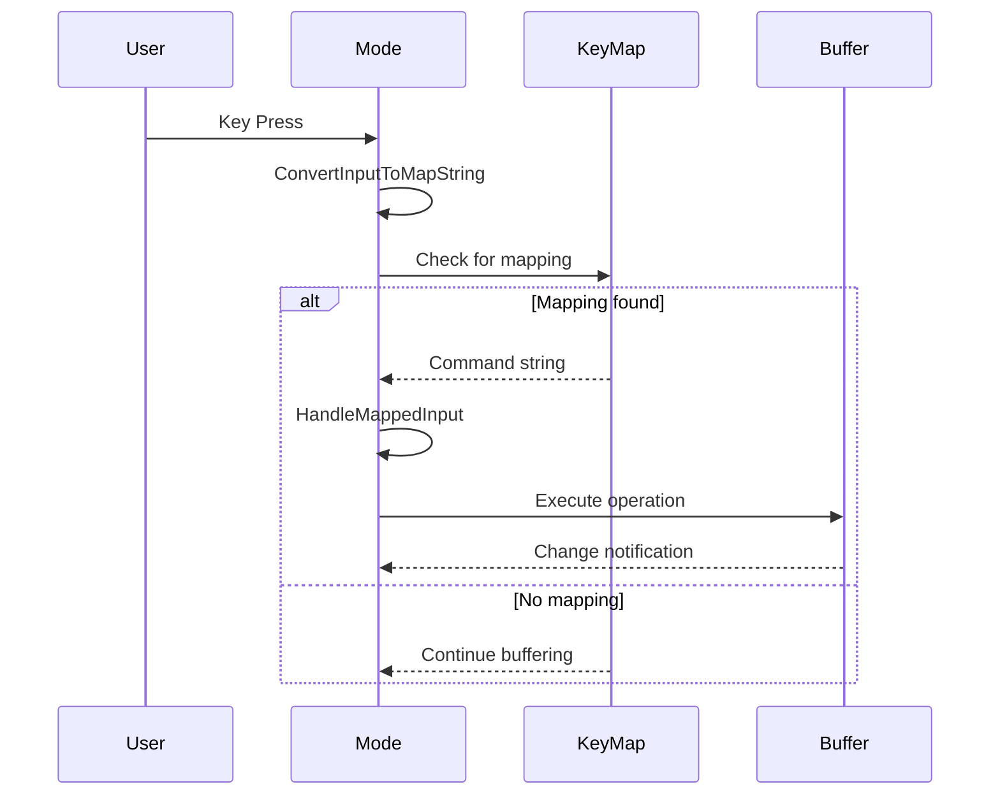

Modes in Zep handle user input and translate key presses into buffer operations. The mode system is designed to support both modal editing (like Vim) and standard editing behaviors.

## EditorMode Enum

Zep defines several editor modes:

From `include/zep/mode.h:66-73`:

```cpp
enum class EditorMode
{
    None,
    Normal,   // Command mode (Vim)
    Insert,   // Insert text (Vim) or default (Standard)
    Visual,   // Visual selection (Vim)
    Ex        // Command-line mode (Vim)
};
```

<CardGroup cols={2}>
  <Card title="Normal Mode" icon="terminal">
    Vim-style command mode for navigation and operations
  </Card>
  <Card title="Insert Mode" icon="keyboard">
    Text insertion mode, default for standard editors
  </Card>
  <Card title="Visual Mode" icon="highlighter">
    Visual selection mode for Vim-style text objects
  </Card>
  <Card title="Ex Mode" icon="command">
    Command-line mode for ex commands (`:w`, `:q`, etc.)
  </Card>
</CardGroup>

## ZepMode Base Class

All modes inherit from the `ZepMode` base class:

From `include/zep/mode.h:151-156`:

```cpp
class ZepMode : public ZepComponent
{
public:
    ZepMode(ZepEditor& editor);
    virtual ~ZepMode();
    
    virtual void Init(){};
    virtual void AddKeyPress(uint32_t key, uint32_t modifierKeys = ModifierKey::None);
    virtual const char* Name() const = 0;
    virtual void Begin(ZepWindow* pWindow);
    virtual EditorMode DefaultMode() const = 0;
```

### Key Mode Methods

<Accordion title="AddKeyPress">
**Purpose**: Process a single key press

**Parameters**:
- `key` - The character or special key code
- `modifierKeys` - Ctrl, Alt, Shift flags

**Workflow**:
1. Convert key to internal representation
2. Append to command string
3. Check keymap for matching command
4. Execute command if found
</Accordion>

<Accordion title="HandleMappedInput">
**Purpose**: Execute commands once key sequence is recognized

**Workflow**:
1. Parse command string
2. Extract counts, registers, operators
3. Build CommandContext
4. Execute buffer operations
5. Switch modes if necessary
</Accordion>

<Accordion title="GetCommand">
**Purpose**: Parse the command context from input string

**Returns**: `true` if valid command found

**Sets up**:
- Operation type (delete, copy, paste)
- Range to operate on
- Register to use
- Count multiplier
</Accordion>

## Built-in Modes

### Vim Mode

From `include/zep/mode_vim.h:22-55`:

```cpp
class ZepMode_Vim : public ZepMode
{
public:
    ZepMode_Vim(ZepEditor& editor);
    virtual ~ZepMode_Vim();
    
    static const char* StaticName()
    {
        return "Vim";
    }
    
    virtual EditorMode DefaultMode() const override
    {
        return EditorMode::Normal;  // Start in Normal mode
    }
    
    virtual bool UsesRelativeLines() const override
    {
        return true;  // Show relative line numbers
    }
    
    virtual void SetupKeyMaps();
    virtual void AddNavigationKeyMaps(bool allowInVisualMode = true);
    virtual void AddSearchKeyMaps();
    // ... more setup methods
};
```

<Info>
Vim mode provides full modal editing with operators, motions, text objects, and ex commands. It starts in Normal mode.
</Info>

#### Vim Mode Features

- **Operators**: `d` (delete), `c` (change), `y` (yank), `p` (paste)
- **Motions**: `h/j/k/l`, `w/b/e`, `0/$`, `gg/G`
- **Text Objects**: `iw` (inner word), `aw` (a word), `i(`, `a{`
- **Counts**: `3dd`, `5w`, `2j`
- **Registers**: `"ayw`, `"bp`
- **Dot Command**: `.` repeats last change
- **Visual Mode**: `v`, `V`, `Ctrl-v`
- **Ex Commands**: `:w`, `:q`, `:s/find/replace/`

### Standard Mode

From `include/zep/mode_standard.h:8-28`:

```cpp
class ZepMode_Standard : public ZepMode
{
public:
    ZepMode_Standard(ZepEditor& editor);
    ~ZepMode_Standard();
    
    virtual void Init() override;
    virtual void Begin(ZepWindow* pWindow) override;
    
    virtual EditorMode DefaultMode() const override
    {
        return EditorMode::Insert;  // Always in Insert mode
    }
    
    static const char* StaticName()
    {
        return "Standard";
    }
    
    virtual const char* Name() const override
    {
        return StaticName();
    }
};
```

<Note>
Standard mode behaves like typical modern editors - you're always inserting text, and modifier keys (Ctrl+C, Ctrl+V) perform operations.
</Note>

#### Standard Mode Features

- Direct text insertion (no mode switching)
- Ctrl+C / Ctrl+V for copy/paste
- Shift+arrows for selection
- Ctrl+arrow keys for word movement
- Home/End for line navigation
- Standard undo/redo (Ctrl+Z / Ctrl+Y)

## Key Processing Flow



## Keymaps

Modes use keymaps to translate input sequences to commands:

From `include/zep/mode.h:237-240`:

```cpp
// Keyboard mappings
KeyMap m_normalMap;
KeyMap m_visualMap;
KeyMap m_insertMap;
```

### KeyMap Structure

Keymaps support:
- **Multi-key sequences**: `gg`, `dd`, `ci(`
- **Counts**: `3j`, `5dd`
- **Registers**: `"a`, `"b`
- **Modifier keys**: `<C-w>`, `<C-r>`

<Accordion title="Example Keymap Registration">
```cpp
// Register "dd" to delete line
m_normalMap.RegisterCommand(
    "dd",
    [](ZepEditor& editor, const KeyMap& keymap) {
        // Delete current line
    },
    "Delete line"
);

// Register "3dd" - count is handled automatically
m_normalMap.RegisterCommand(
    "d<count>d",
    [](ZepEditor& editor, const KeyMap& keymap) {
        // Delete <count> lines
    },
    "Delete lines"
);
```
</Accordion>

## Command Context

When a command is recognized, a `CommandContext` is built:

From `include/zep/mode.h:114-149`:

```cpp
class CommandContext
{
public:
    CommandContext(const std::string& commandIn, ZepMode& md, 
                   EditorMode editorMode);
    
    ZepMode& owner;
    std::string fullCommand;
    KeyMapResult keymap;
    
    ReplaceRangeMode replaceRangeMode = ReplaceRangeMode::Fill;
    GlyphIterator beginRange;
    GlyphIterator endRange;
    ZepBuffer& buffer;
    
    // Cursor State
    GlyphIterator bufferCursor;
    GlyphIterator cursorAfterOverride;
    
    // Register state
    std::stack<char> registers;
    Register tempReg;
    const Register* pRegister = nullptr;
    
    // Input State
    EditorMode currentMode = EditorMode::None;
    
    // Output result
    CommandResult commandResult;
    CommandOperation op = CommandOperation::None;
    
    bool foundCommand = false;
};
```

### Command Operations

From `include/zep/mode.h:75-85`:

```cpp
enum class CommandOperation
{
    None,
    Delete,       // Delete text
    DeleteLines,  // Delete complete lines
    Insert,       // Insert text
    Copy,         // Copy (yank) text
    CopyLines,    // Copy complete lines
    Replace,      // Replace text
    Paste         // Paste from register
};
```

## Mode Switching

From `include/zep/mode.h:182`:

```cpp
virtual void SwitchMode(EditorMode currentMode);
```

Mode switching happens when:
- User presses mode change key (Vim: `i`, `v`, `Esc`, `:`)
- Command completes and specifies mode switch
- Ex command executed (e.g., `:visual`)

<Info>
Mode switching updates the cursor appearance, key mappings, and editing behavior.
</Info>

## Cursor Types

From `include/zep/mode.h:180`:

```cpp
virtual CursorType GetCursorType() const;
```

Different modes show different cursors:
- **Normal Mode**: Block cursor
- **Insert Mode**: Line cursor
- **Visual Mode**: Block cursor (with selection highlight)

## Implementing Custom Modes

To create a custom mode:

1. **Inherit from ZepMode**
```cpp
class MyCustomMode : public ZepMode
{
public:
    MyCustomMode(ZepEditor& editor) : ZepMode(editor) {}
    
    virtual const char* Name() const override { return "Custom"; }
    virtual EditorMode DefaultMode() const override { 
        return EditorMode::Insert; 
    }
};
```

2. **Override Init() to setup keymaps**
```cpp
virtual void Init() override
{
    // Register your key mappings
    m_insertMap.RegisterCommand(/* ... */);
}
```

3. **Handle input in AddKeyPress() or override HandleMappedInput()**

4. **Register with editor**
```cpp
auto mode = std::make_shared<MyCustomMode>(editor);
editor.RegisterGlobalMode(mode);
editor.SetGlobalMode("Custom");
```

## Modifier Keys

From `include/zep/mode.h:55-64`:

```cpp
struct ModifierKey
{
    enum Key
    {
        None = (0),
        Ctrl = (1 << 0),
        Alt = (1 << 1),
        Shift = (1 << 2)
    };
};
```

Modifiers can be combined:
```cpp
ModifierKey::Ctrl | ModifierKey::Shift
```

## Special Keys

From `include/zep/mode.h:19-52`:

```cpp
struct ExtKeys
{
    enum Key
    {
        RETURN = 0,
        ESCAPE = 1,
        BACKSPACE = 2,
        LEFT = 3,
        RIGHT = 4,
        UP = 5,
        DOWN = 6,
        TAB = 7,
        DEL = 8,
        HOME = 9,
        END = 10,
        PAGEDOWN = 11,
        PAGEUP = 12,
        F1 = 13,
        // ... F2-F12
    };
};
```

<Note>
Special keys are mapped to values 0-31 (below ASCII space) to avoid conflicts with printable characters.
</Note>

## Undo and Redo

Modes provide undo/redo operations:

From `include/zep/mode.h:177-178`:

```cpp
virtual void Undo();
virtual void Redo();
```

These delegate to the buffer's command stacks:
```cpp
buffer.GetUndoStack();
buffer.GetRedoStack();
```

## Next Steps

<CardGroup cols={2}>
  <Card title="Buffers" href="/concepts/buffers">
    Learn how modes interact with buffer operations
  </Card>
  <Card title="Display Layer" href="/concepts/display-layer">
    Understand how modes affect rendering
  </Card>
</CardGroup>
